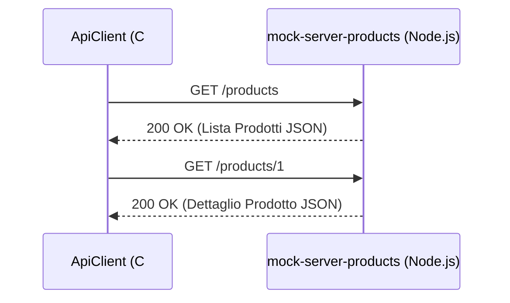
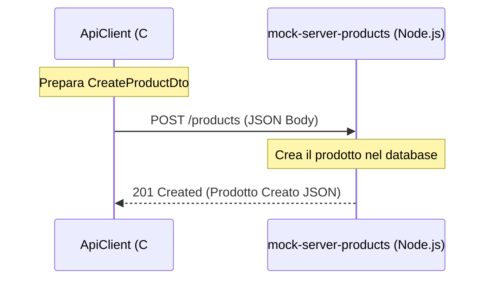
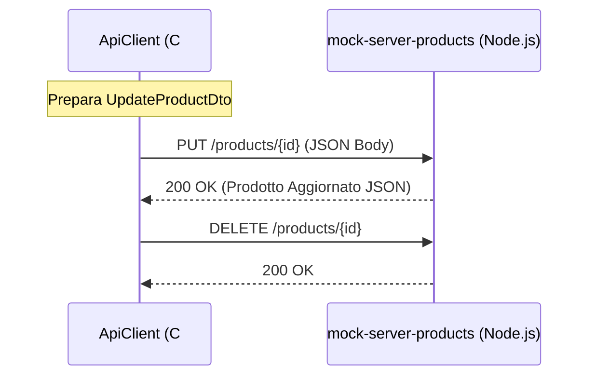

# ApiClient

Questo progetto è un'applicazione console C# che funge da client per testare le API RESTful esposte dal server `mock-server-products` (o dal server reale `MinimalApiCrudSqlite`). Questo client implementa le operazioni CRUD di base **senza** richiedere alcuna autenticazione.

## Scopo del Progetto

L'obiettivo principale di `ApiClient` è dimostrare come:

1. Configurare un'istanza di `HttpClient` in C#.
2. Effettuare richieste HTTP (GET, POST, PUT, DELETE) a un'API RESTful.
3. Serializzare e deserializzare i dati JSON utilizzando `System.Text.Json` e i Data Transfer Object (DTO).
4. Gestire le risposte HTTP e gli eventuali errori.

## Prerequisiti

- [.NET 9.0 SDK](https://dotnet.microsoft.com/download/dotnet/9.0) (o versione compatibile).
- Il server `mock-server-products` in esecuzione sulla porta `3000` (`http://localhost:3000`).

## Esecuzione

1. Assicurati che il server `mock-server-products` sia in esecuzione.
2. Apri un terminale nella cartella `ApiClient`.
3. Esegui il comando:

   ```bash
   dotnet run
   ```

## Flusso di Esecuzione (Diagrammi di Sequenza)

Di seguito sono riportati i diagrammi di sequenza che illustrano i flussi principali implementati nell'applicazione.

### 1. Lettura dei Dati (GET)

Il client richiede la lista dei prodotti o un singolo prodotto. Il server risponde con i dati in formato JSON.



### 2. Creazione di un Prodotto (POST)

Il client invia i dati di un nuovo prodotto al server. Il server lo crea e restituisce il prodotto appena creato con il suo nuovo ID.



### 3. Aggiornamento ed Eliminazione (PUT / DELETE)

Il client aggiorna un prodotto esistente o lo elimina.



## Struttura del Codice

- `Program.cs`: Contiene il punto di ingresso dell'applicazione (`Main`) e tutta la logica per effettuare le richieste HTTP.
  - `ConfigureHttpClient()`: Inizializza l'`HttpClient` e imposta l'header `Accept` per richiedere risposte in JSON.
  - `TestGetAllProducts()`, `TestGetProductById()`, `TestCreateProduct()`, `TestUpdateProduct()`, `TestDeleteProduct()`: Metodi che implementano le singole operazioni CRUD.
- `Models/`: Cartella che contiene i Data Transfer Object (DTO) utilizzati per mappare i dati JSON in oggetti C# (es. `ProductDto`, `CreateProductDto`, `UpdateProductDto`). Questi modelli sono condivisi con il progetto `ApiClientAuth`.
