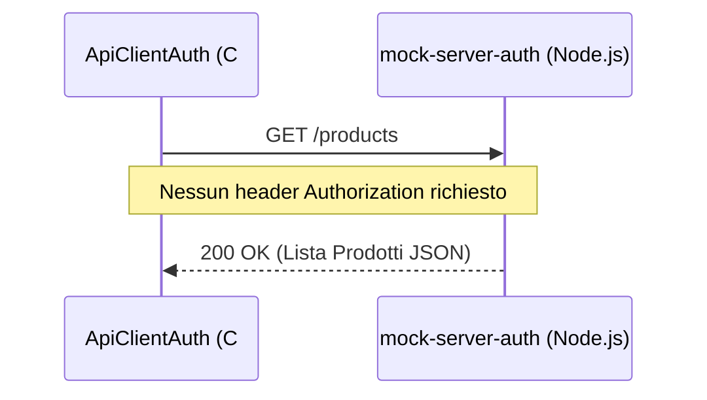
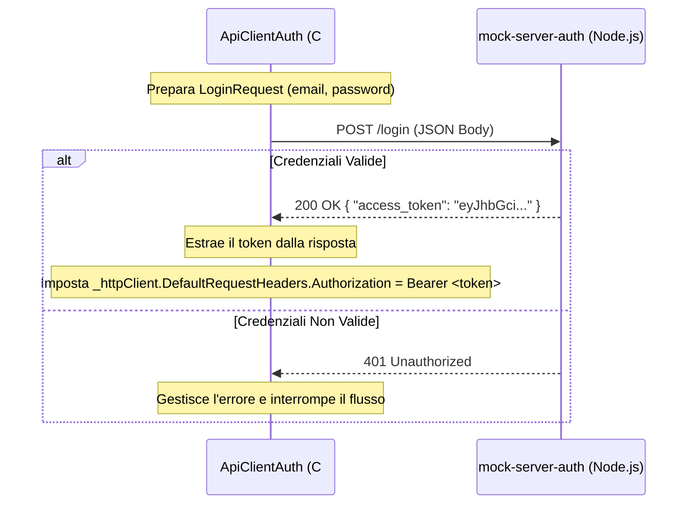
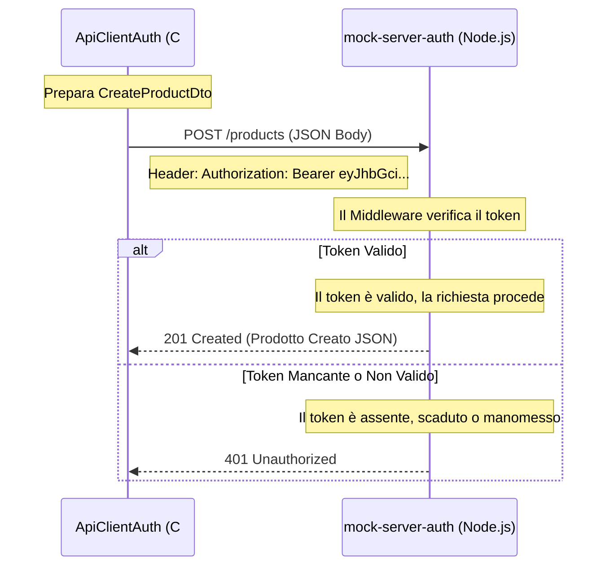

# ApiClientAuth

Questo progetto è un'applicazione console C# che funge da client per testare le API RESTful esposte dal server `mock-server-auth`. A differenza del progetto base `ApiClient`, questo client implementa la logica necessaria per gestire l'**autenticazione basata su JWT (JSON Web Token)**.

## Scopo del Progetto

L'obiettivo principale di `ApiClientAuth` è dimostrare come:

1. Effettuare richieste HTTP a endpoint pubblici (es. `GET /products`).
2. Autenticarsi presso un server inviando credenziali (email e password) a un endpoint di login (`POST /login`).
3. Ricevere, estrarre e memorizzare un token JWT dalla risposta del server.
4. Configurare un'istanza di `HttpClient` per includere automaticamente il token JWT nell'header `Authorization` (schema `Bearer`) per tutte le richieste successive.
5. Eseguire operazioni CRUD (Create, Read, Update, Delete) su endpoint protetti che richiedono l'autenticazione.

## Prerequisiti

- [.NET 9.0 SDK](https://dotnet.microsoft.com/download/dotnet/9.0) (o versione compatibile).
- Il server `mock-server-auth` in esecuzione sulla porta `3001` (`http://localhost:3001`).

## Esecuzione

1. Assicurati che il server `mock-server-auth` sia in esecuzione.
2. Apri un terminale nella cartella `ApiClientAuth`.
3. Esegui il comando:

   ```bash
   dotnet run
   ```

## Flusso di Esecuzione (Diagrammi di Sequenza)

Di seguito sono riportati i diagrammi di sequenza che illustrano i flussi principali implementati nell'applicazione.

### 1. Richiesta a un Endpoint Pubblico

Le richieste di lettura (GET) non richiedono autenticazione. Il client effettua la richiesta e il server risponde direttamente con i dati.



### 2. Flusso di Autenticazione (Login)

Per accedere agli endpoint protetti, il client deve prima autenticarsi. Invia le credenziali all'endpoint `/login` e riceve in cambio un token JWT.



### 3. Richiesta a un Endpoint Protetto (con Token)

Una volta ottenuto il token e configurato l'`HttpClient`, il client può effettuare richieste agli endpoint protetti (POST, PUT, DELETE). Il token viene inviato automaticamente nell'header `Authorization`.



## Struttura del Codice

- `Program.cs`: Contiene il punto di ingresso dell'applicazione (`Main`) e tutta la logica per effettuare le richieste HTTP.
  - `ConfigureHttpClient()`: Inizializza l'`HttpClient` e imposta l'header `Accept` per richiedere risposte in JSON.
  - `TestLogin()`: Gestisce l'invio delle credenziali e la configurazione dell'header `Authorization` con il token ricevuto.
  - `TestGetAllProducts()`, `TestGetProductById()`, `TestCreateProduct()`, `TestUpdateProduct()`, `TestDeleteProduct()`: Metodi che implementano le singole operazioni CRUD.
- `LoginRequest` e `LoginResponse`: Classi (DTO) utilizzate per serializzare/deserializzare i dati durante la fase di login.
- I modelli dei dati (es. `ProductDto`, `CreateProductDto`) sono condivisi e referenziati dal progetto `ApiClient.Models`.
