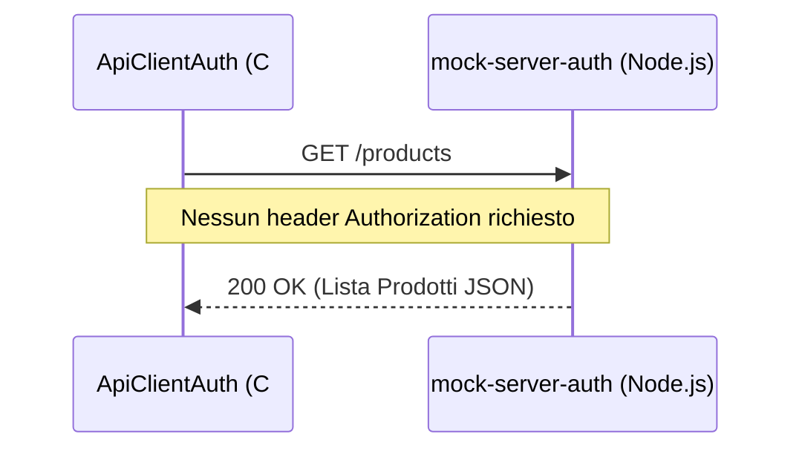
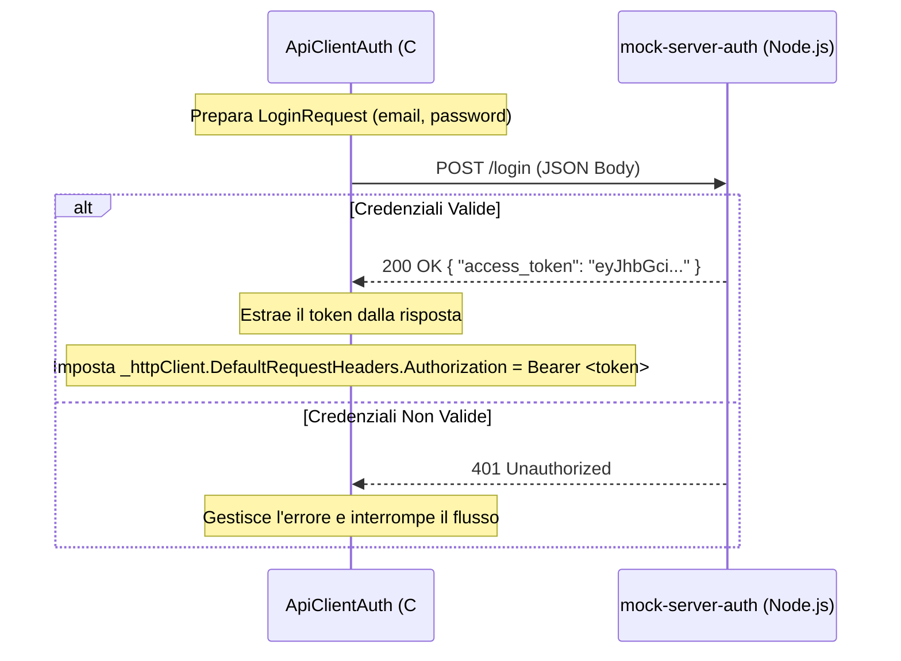
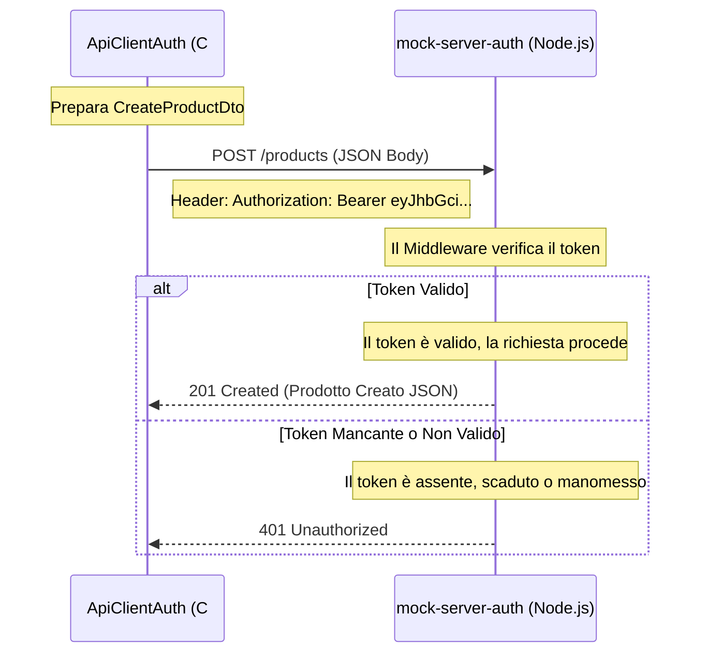

# ApiClientAuth

Questo progetto è un'applicazione console C# che funge da client per testare le API RESTful esposte dal server `mock-server-auth`. A differenza del progetto base `ApiClient`, questo client implementa la logica necessaria per gestire l'**autenticazione basata su JWT (JSON Web Token)**.

## Scopo del Progetto

L'obiettivo principale di `ApiClientAuth` è dimostrare come:

1. Effettuare richieste HTTP a endpoint pubblici (es. `GET /products`).
2. Autenticarsi presso un server inviando credenziali (email e password) a un endpoint di login (`POST /login`).
3. Ricevere, estrarre e memorizzare un token JWT dalla risposta del server.
4. Configurare un'istanza di `HttpClient` per includere automaticamente il token JWT nell'header `Authorization` (schema `Bearer`) per tutte le richieste successive.
5. Eseguire operazioni CRUD (Create, Read, Update, Delete) su endpoint protetti che richiedono l'autenticazione.
6. Eseguire query di esempio compatibili con `json-server` stabile `0.17.4` (filtri, ordinamenti multipli, paginazione).
7. Scaricare l'immagine associata a un prodotto e salvarla localmente.

## Prerequisiti

- [.NET 9.0 SDK](https://dotnet.microsoft.com/download/dotnet/9.0) (o versione compatibile).
- Il server `mock-server-auth` in esecuzione sulla porta `3001` (`http://localhost:3001`).

## Esecuzione

1. Assicurati che il server `mock-server-auth` sia in esecuzione.
2. Apri un terminale nella cartella `ApiClientAuth`.
3. Esegui il comando:

   ```bash
   dotnet run
   ```

## Nota su JsonSerializerOptions

Nei progetti precedenti puo essere normale vedere `JsonSerializerOptions` passato alle richieste JSON (ad esempio in `ReadFromJsonAsync(..., options)` o `PostAsJsonAsync(..., options)`).

In questo esempio, invece, i modelli in `Models` usano `JsonPropertyName` su tutte le proprieta principali: questo rende gia esplicita la mappatura tra C# e JSON e spesso rende non necessario configurare opzioni custom.

Quando conviene usare comunque le options:

- vuoi tolleranza verso casing incoerente (`PropertyNameCaseInsensitive = true`);
- devi aggiungere converter personalizzati (date, enum come stringhe, formati custom);
- vuoi una configurazione JSON centralizzata e uniforme in tutto il progetto.

Quando puoi evitarle:

- controlli il contratto API;
- i nomi JSON sono esplicitati con `JsonPropertyName`;
- preferisci un esempio didattico piu lineare.

## Esempi Console

Esempio di output durante l'esecuzione dei test pubblici:

```text
Eseguendo GET /products...
Successo (OK). Ricevuti 30 prodotti.

Esempio: prezzo medio di tutti i prodotti (GET /products)...
Prezzo medio complessivo: 482,09 (su 30 prodotti)
```

Esempio di output per il download immagine prodotto:

```text
Esempio: download immagine associata al prodotto ID 1...
Immagine scaricata con successo: ...\bin\Debug\net9.0\downloads\product-1-electronics.png (42858 byte)

Esempio semplificato: download immagine prodotto ID 1 (URL assoluto)...
Immagine (metodo semplificato) salvata: ...\bin\Debug\net9.0\downloads\product-1-simple.png (42858 byte)
```

Esempio di uso del menu interattivo:

```text
--- Menu Esempi Query json-server 0.17.4 ---
Categoria [electronics]:
Pagina [1]:
Dimensione pagina [3]:
```

## Esempi inclusi nel client

Il `Main` esegue una serie di test automatici che coprono:

- **Prezzo medio di tutti i prodotti**: `GET /products` e media lato client.
- **Prezzo medio per categoria**: `GET /products?category=<valore>`.
- **Top 3 per ranking (rating) in ogni categoria**: `GET /products?_sort=category,rating&_order=asc,desc`.
- **Elenco prodotti per categoria paginato e ordinato per prezzo decrescente**: `GET /products?category=<valore>&_sort=price&_order=desc&_page=<n>&_limit=<size>`.
- **Menu interattivo da console**: permette di inserire categoria/pagina/pageSize a runtime (utile con dati Faker variabili).

### Download immagine prodotto

Sono presenti due versioni del test di download immagine:

- `TestDownloadProductImage(...)` (versione completa):
    - recupera il prodotto,
    - seleziona URL da `thumbnail` (fallback su `images[0].url`),
    - gestisce URL relativo/assoluto,
    - salva il file in `bin/Debug/net9.0/downloads`.
- `TestDownloadProductImageSimple(...)` (versione semplificata):
    - assume URL già assoluto,
    - scarica direttamente con `GetByteArrayAsync(...)`,
    - salva il file in `bin/Debug/net9.0/downloads`.

## Flusso di Esecuzione (Diagrammi di Sequenza)

Di seguito sono riportati i diagrammi di sequenza che illustrano i flussi principali implementati nell'applicazione.

### 1. Richiesta a un Endpoint Pubblico

Le richieste di lettura (GET) non richiedono autenticazione. Il client effettua la richiesta e il server risponde direttamente con i dati.


```mermaid
sequenceDiagram
    participant Client as ApiClientAuth (C#)
    participant Server as mock-server-auth (Node.js)

    Client->>Server: GET /products
    Note over Client,Server: Nessun header Authorization richiesto
    Server-->>Client: 200 OK (Lista Prodotti JSON)
```

### 2. Flusso di Autenticazione (Login)

Per accedere agli endpoint protetti, il client deve prima autenticarsi. Invia le credenziali all'endpoint `/login` e riceve in cambio un token JWT.


```mermaid
sequenceDiagram
    participant Client as ApiClientAuth (C#)
    participant Server as mock-server-auth (Node.js)

    Note over Client: Prepara LoginRequest (email, password)
    Client->>Server: POST /login (JSON Body)
    
    alt Credenziali Valide
        Server-->>Client: 200 OK { "access_token": "eyJhbGci..." }
        Note over Client: Estrae il token dalla risposta
        Note over Client: Imposta _httpClient.DefaultRequestHeaders.Authorization = Bearer <token>
    else Credenziali Non Valide
        Server-->>Client: 401 Unauthorized
        Note over Client: Gestisce l'errore e interrompe il flusso
    end
```

### 3. Richiesta a un Endpoint Protetto (con Token)

Una volta ottenuto il token e configurato l'`HttpClient`, il client può effettuare richieste agli endpoint protetti (POST, PUT, DELETE). Il token viene inviato automaticamente nell'header `Authorization`.


```mermaid
sequenceDiagram
    participant Client as ApiClientAuth (C#)
    participant Server as mock-server-auth (Node.js)

    Note over Client: Prepara CreateProductDto
    Client->>Server: POST /products (JSON Body)
    Note right of Client: Header: Authorization: Bearer eyJhbGci...
    
    Note over Server: Il Middleware verifica il token
    
    alt Token Valido
        Note over Server: Il token è valido, la richiesta procede
        Server-->>Client: 201 Created (Prodotto Creato JSON)
    else Token Mancante o Non Valido
        Note over Server: Il token è assente, scaduto o manomesso
        Server-->>Client: 401 Unauthorized
    end
```

## Troubleshooting

- **Errore di connessione (`Connection refused`, timeout, `No such host`)**
    - Verifica che `mock-server-auth` sia avviato su `http://localhost:3001`.
    - Controlla la variabile `_apiBaseUrl` in `Program.cs`.
    - Verifica da console se la porta è occupata (PowerShell):

        ```powershell
        Get-NetTCPConnection -LocalPort 3001 -State Listen | Select-Object LocalAddress, LocalPort, OwningProcess
        ```

    - In alternativa (CMD/PowerShell), mostra PID associato alla porta:

        ```bash
        netstat -ano | findstr :3001
        ```

    - Per identificare il processo dal PID:

        ```powershell
        Get-Process -Id <PID>
        ```

    - Per terminare il processo che occupa la porta:

        ```powershell
        Stop-Process -Id <PID> -Force
        ```

    - Verifica finale che la porta sia libera:

        ```powershell
        Get-NetTCPConnection -LocalPort 3001 -ErrorAction SilentlyContinue
        ```

- **`401 Unauthorized` su endpoint protetti**
    - Verifica credenziali del login (`admin@example.com` / `admin123`).
    - Assicurati che `TestLogin()` venga eseguito prima di POST/PUT/DELETE.

- **Categoria senza risultati**
    - Con dati Faker, le categorie possono cambiare ad ogni seed/dataset.
    - Inserisci una categoria diversa dal menu interattivo e riprova.

- **Download immagine fallito**
    - Verifica che URL in `thumbnail` o `images[].url` sia raggiungibile dal client.
    - Controlla che il server esponga correttamente la cartella `assets/products_media`.
    - Se il path è relativo, usa il metodo completo `TestDownloadProductImage(...)`.

- **File immagine non trovato nella cartella attesa**
    - I file vengono salvati in `bin/Debug/net9.0/downloads` (cartella di output runtime).
    - Esegui una nuova build/run se hai cambiato configurazione (Debug/Release).

## Struttura del Codice

- `Program.cs`: Contiene il punto di ingresso dell'applicazione (`Main`) e tutta la logica per effettuare le richieste HTTP.
  - `ConfigureHttpClient()`: Inizializza l'`HttpClient` e imposta l'header `Accept` per richiedere risposte in JSON.
  - `TestLogin()`: Gestisce l'invio delle credenziali e la configurazione dell'header `Authorization` con il token ricevuto.
    - `TestGetAllProducts()`, `TestGetProductById()`, `TestCreateProduct()`, `TestUpdateProduct()`, `TestDeleteProduct()`: Metodi CRUD principali.
    - `TestGetAveragePriceAllProducts()`, `TestGetAveragePriceByCategory()`: Esempi di aggregazione lato client.
    - `TestPrintTopThreeProductsByRankingPerCategory()`: Esempio di ordinamento/raggruppamento per ranking.
    - `TestListProductsByCategoryPagedAndSorted()`: Esempio di filtro + ordinamento + paginazione secondo notazione `json-server 0.17.4`.
    - `RunInteractiveQueryExamples()`: Menu interattivo per testare query con input runtime.
    - `TestDownloadProductImage()`, `TestDownloadProductImageSimple()`: Esempi di download immagini prodotto.
- `LoginRequest` e `LoginResponse`: Classi (DTO) utilizzate per serializzare/deserializzare i dati durante la fase di login.
- I modelli dei dati (es. `ProductDto`, `CreateProductDto`) sono condivisi e referenziati dal progetto `ApiClient.Models`.
