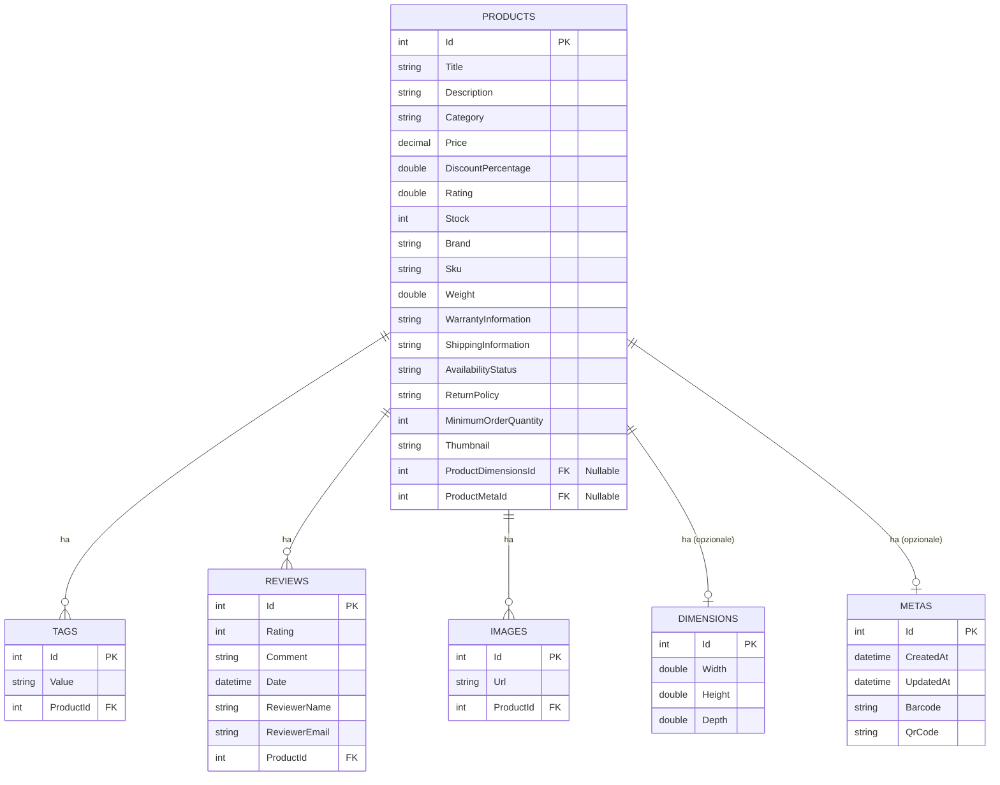

# Modello dei dati

**Spiegazione del Diagramma:**

* **Entità:** Rappresenta le tabelle del database (`PRODUCTS`, `DIMENSIONS`, `METAS`, `TAGS`, `REVIEWS`, `IMAGES`).
* **Attributi:** Elenca le colonne di ciascuna tabella con il tipo di dato C# (che mappa a tipi SQLite) e se sono chiavi primarie (`PK`) o esterne (`FK`). `NN` indica Not Null (basato sull'attributo `[Required]` o sul tipo non nullable), `NULL` indica che il campo può essere nullo.
* **Relazioni:**
    * `||--o{`: Relazione uno-a-molti (es. `PRODUCTS` ha molti `TAGS`).
    * `||--||`: Relazione uno-a-uno (es. `PRODUCTS` ha uno `DIMENSIONS`). La relazione è marcata come opzionale basandosi sul fatto che le FK `ProductDimensionsId` e `ProductMetaId` in `PRODUCTS` sono nullable.
* **Cardinalità:**
    * `o{`: Indica "molti".
    * `||`: Indica "uno".
* **Vincoli FK:** Le frecce indicano la direzione della chiave esterna (es. `TAGS` ha una FK `ProductId` che punta a `PRODUCTS.Id`).
* **On Delete Behavior:**
    * Le relazioni uno-a-molti (`TAGS`, `REVIEWS`, `IMAGES`) con `PRODUCTS` hanno `OnDelete(DeleteBehavior.Cascade)` (configurato nel `DbContext`), significa che eliminando un prodotto verranno eliminati anche i record correlati in queste tabelle.
    * Le relazioni uno-a-uno (`DIMENSIONS`, `METAS`) con `PRODUCTS` hanno `OnDelete(DeleteBehavior.SetNull)` (configurato nel `DbContext`), significa che eliminando un prodotto, le FK corrispondenti in `PRODUCTS` verranno impostate a NULL (se i record in `DIMENSIONS` o `METAS` esistono ancora).
* **Default Value:** La colonna `Date` nella tabella `REVIEWS` ha un valore predefinito `CURRENT_TIMESTAMP` come specificato nel `DbContext`.
